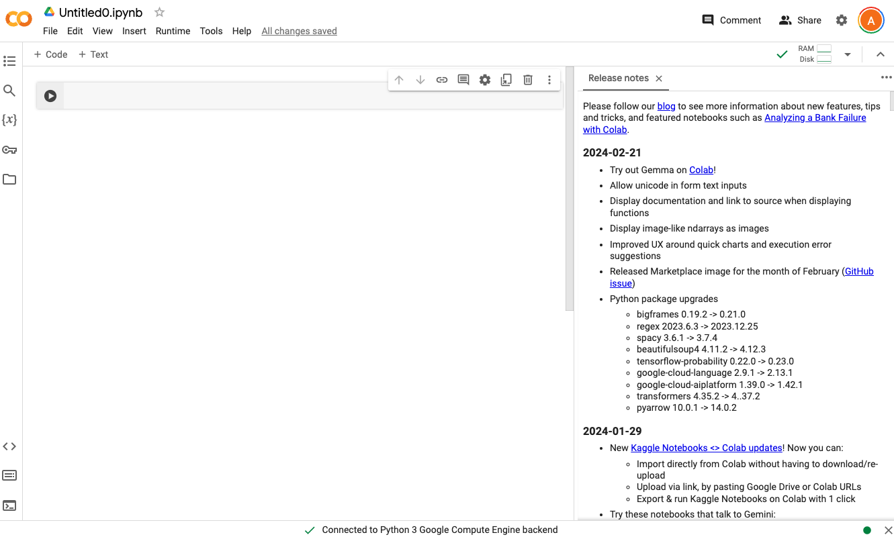

---
jupytext:
  formats: md:myst
  text_representation:
    extension: .md
    format_name: myst
kernelspec:
  display_name: Python 3
  language: python
  name: python3
---

# Introducing Colaboratory

**Colaboratory** or **Colab** is a free cloud-based platform provided by Google that allows user to write and execute
Python
code
in a browser environment. The main advantages of Colab are:

* **Free cloud-based computing**:  Colab allows you to run a Python Jupyter Notebook directly in your browser, without
  the need for any setup or installation!  The code runs on Google's powerful cloud infrastructure.
* **Collaboration**: Similarly to Google Docs, multiple users are able to work simultaneously on the same notebook,
  enabling real-time collaboration.
* **Pre-installed libraries**:  Colab comes with many popular Python libraries pre-installed, including NumPy, Pandas,
  Matplotlib, among others. This allows users to get started more quickly, eliminating the need to spend time installing
  these libraries.
* **Integration with Google Drive and GitHub**: Colab creates notebooks on Google Drive allowing users to store these
  files in their respective folders on Google Drive. It also supports integration with GitHub, enabling version control
  and easy sharing of notebooks with the broader community. We will look at how to do this later on in the course.

In this course, we are going to use Colab to create Jupyter Notebooks. There are several other tools that one can use to
create Jupyter Notebooks and we will be looking at creating Jupyter Notebooks in PyCharm, for those who prefer to use an
Integrated Development Environment (IDE) to code.

## Creating Jupyter Notebooks in Colab

To create a Jupyter Notebook in Colab:

1. Log in to your Google account.
2. Select or create the folder where you want to create your Colab document.
3. Select **New|More** and choose **Colab**. If **Colab** is not on your list, this means that the Colab app is not
   installed in your Google account. To install Colab, select **New|More|Connect more apps**. In the Google Marketplace
   window, search for **Colab**, select the Colaboratory app as shown below, and follow the installation instructions.
   
4. Once installed, to create a new Colab document, in your Google Drive select **New|More|Google Colaboratory**. This
   creates a new Colab document as shown below:
   
5. The Colab document is automatically renamed as `Untitled`. Note also that it has the `.ipynb` extension.  **Jupyter
   Notebook files have a `.ipynb` file extension.**  To rename the document, click on the file name at the top-left hand
   side on the document and rename it to `notebook1.ipynb`. 

Well done, you have just created your first Jupyter Notebook!  The Notebook is currently empty, so let's get started
with filling this up.

## Jupyter Notebook Cells

A Jupyter notebook is composed of a list of cells. You can add as many cells as you need in your Notebook. In Colab,
cells can be of two types:

1. Code
2. Text

## Running Jupyter Notebooks

When creating a new Colab document, the notebook is initialised with an empty code cell.

1. In the code cell displayed, enter the following `print("Hello Jupyter!")`
2. Click on the Play icon  in the left gutter of the cell 
to get the output of the code displayed underneath the code cell. The output should be as follows: 

```{figure} images/colab-hello-jupyter.png
---
name: colab-hello-jupyter
scale: 40%
---
```


