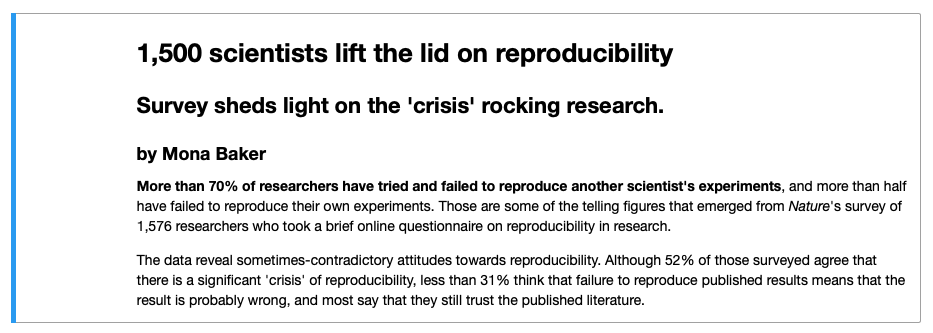

---
jupytext:
  formats: md:myst
  text_representation:
    extension: .md
    format_name: myst
kernelspec:
  display_name: Python 3
  language: python
  name: python3
---

# Text Cells

Text Cells are cells that contain **Markdown**.  Markdown is a markup language that is used to format text. In this section,
we are going to look at different formatting options to make our text more structured and user-friendly.  

To add a Text cell:  
1.  Choose the `+Text` button in the top toolbar 
2.  This will add the text cell in your Jupyter Notebook. Double-click on the cell and start typing your Markdown.  There 
    is a display panel on the right-hand-side that shows the output of your Markdown which is very helpful.
3.  To stop editing the Text cell, click on the `Close markdown editor` button  
    that is present on the top tight-hand-side of the cell menu.

Let's start looking at how to use Markdown below.  

## Headings

Below is the Markdown code you need to use to specify headings at different levels and the rendered output respectively below the code:

`# Heading 1`

<p style="font-weight:500; font-size:34px">Heading 1</p>

`## Heading 2`

<p style="font-weight:500; font-size:30px">Heading 2</p>

`### Heading 3`

<p style="font-weight:500; font-size:24px">Heading 3</p>

`#### Heading 4`

<p style="font-weight:500; font-size:18px">Heading 4</p>

## Inline text formatting

To make text **bold** use `**double asterisks**` or `__double underscores__`.  
To make text *italic* use `*asterisks*` or `_underscores_`.  
To make text ^superscript^ use `^caret^`.  
To make text ~subscript~ use `~tilde~`.  
To mark text as `inline code` use `` `backticks` ``.   
To  ~~strikethrough~~ text use `~~double tilde~~`.

## Line breaks
To create a line break, put more than 2 spaces at the end of a sentence.

```{exercise-start} Markdown in Jupyter Notebook
:label: markdown1
```
**Level:** {octicon}`star-fill;1em;sd-text-warning` {octicon}`star-fill;1em;sd-text-warning` {octicon}`star;1em;sd-text-warning`

Replicate the output of the text below in a new Jupyter Notebook `notebook2`. 

The text comes from [a paper by Monya Baker](https://www.nature.com/news/1-500-scientists-lift-the-lid-on-reproducibility-1.19970) 
that was published in 2016 in the Nature journal that triggered the discussion about Reproducibility Crisis.

```{exercise-end}
```

```{solution-start} markdown1
:label: markdown1-solution
:class: dropdown
```
```
# 1,500 scientists lift the lid on reproducibility

## Survey sheds light on the 'crisis' rocking research.
### by Mona Baker

**More than 70% of researchers have tried and failed to reproduce another scientist's experiments**, and more than half 
have failed to reproduce their own experiments. Those are some of the telling figures that emerged from *Nature*'s survey 
of 1,576 researchers who took a brief online questionnaire on reproducibility in research.

The data reveal sometimes-contradictory attitudes towards reproducibility. Although 52% of those surveyed agree that 
there is a significant crisis of reproducibility, less than 31% think that failure to reproduce published results means 
that the result is probably wrong, and most say that they still trust the published literature.
```

```{solution-end}
```

## Links

### Linking text to Headers

To link text to a header, use `[link to header](#section-title)`. Inside the parenthesis, write the title text in lower-case 
letters and replace spaces with a hyphen, for example, `[link to header](#text-cells)` will be rendered as [link to header](#text-cells).

### Linking text to a webpage

To create a link to a webpage use `[text of link](https://jupyter.org/)`.  This is rendered as [text of link](https://jupyter.org/). 

## Footnotes

To indicate a footnote use`[^2]`.  Indicate additional footnotes using other numbers as follows `[^3]`, then specify the wordings of the footnotes as:

`[^2]: This is the first footnote.`  
`[^3]: This is the second footnote.`

You do not need to put footnotes at the end of the document for them to be rendered there.  This example is rendered as follows:  

To indicate a footnote use[^2]. Indicate additional footnotes using other numbers as follows[^3], then specify the wordings of the footnotes as:

[^2]: This is the first footnote.  
[^3]: This is the second footnote.

## Lists

### Ordered lists

To create an ordered list use the following syntax:

```
1. Item 1
2. Item 2
3. Item 3
```

This is rendered as:

1. Item 1
2. Item 2
3. Item 3

Use 4 spaces to indent an item if you would like to have sub-lists:
```
1. Item 1
2. Item 2
3. Item 3  
    a. Item 3a  
    b. Item 3b  
    c. Item 3c  
4. Item 4
```

1. Item 1
2. Item 2
3. Item 3  
    a. Item 3a  
    b. Item 3b  
    c. Item 3c  
4. Item 4

### Unordered lists

In an unordered bulletted list, each item begins with `*`, `+` or `-`.  Example:

```
* Item 1
* Item 2
* Item 3
    * Item 3a
        * Item 3ai
        * Item 3aii
    * Item 3b
    * Item 3c
* Item 4
```
Will be rendered as:

* Item 1
* Item 2
* Item 3
    * Item 3a
        * Item 3ai
        * Item 3aii
    * Item 3b
    * Item 3c
* Item 4

## Inserting images
To insert an image use the following syntax: ``.  Example:

``

Will be rendered as:


```{exercise-start} More Markdown
:label: markdown2
```
**Level:** {octicon}`star-fill;1em;sd-text-warning` {octicon}`star-fill;1em;sd-text-warning` {octicon}`star;1em;sd-text-warning`

Continue working on `notebook2.ipynb` from {numref}`markdown1`. Extend the output of `notebook2.ipynb` to look like
[this](https://github.com/ac812/reproducible-research-python/blob/main/docs/notebook-solutions/notebook2.ipynb).  

You can find the image used in this exercise at this location:
https://www.nature.com/news/polopoly_fs/7.36716.1469695923!/image/reproducibility-graphic-online1.jpeg_gen/derivatives/landscape_630/reproducibility-graphic-online1.jpeg

```{exercise-end}
```

More information about Markdown is provided [here](https://colab.research.google.com/notebooks/markdown_guide.ipynb).  Let us 
now look at code cells.
